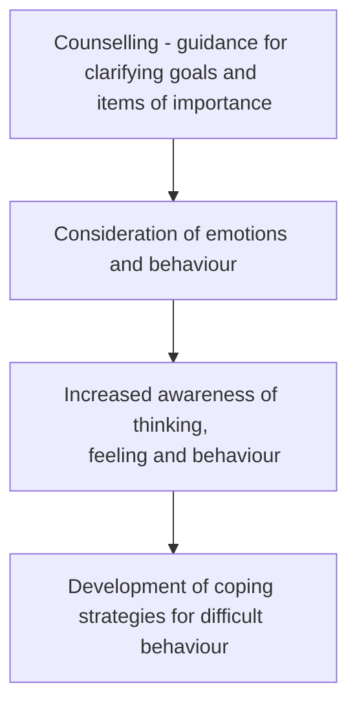

---
area:
  - "[[Diploma of Counselling]]"
section: "[[1 - Communication Skills and the Counselling Framework]]"
course:
  - "[[1.1 - Establish and confirm the counselling relationship]]"
  - "[[1.4 - Support Counselling Clients in the Decision Making Process]]"
unit:
  - "[[1.1.2 - Establish the Nature of the Helping Relationship]]"
  - "[[1.4.2 - Explore Options with the Client]]"
lecture:
  - "[[1.1.2.1 Provide Information that assists clients to understnad the nature of the counselling service on offer]]"
  - "[[1.1.2.5 – Clarify both expectations and commitment to the counselling relationship and confirm with clients]]"
tags:
  - concept
status:
---

## Purpose of Counselling

## Reasons to Attend Counselling
- feeling overwhelmed or [[Depression]]
- needing someone to talk to outside current support network
- issue affecting day-to-day life so much they are unable to make decisions to progress
- Requirement from court instruction
- [[AoD abuse]]
- [[Domestic and Family Violence]]
- [[Stuttering and Stammering]]
- [[Financial Difficulty]]
- [[Gambling Problems]]

## Counselling as a professional service
- Helping service like medical and healthcare, life skills agencies, local government council services, charitable organisations, support organisations, community support groups and services, legal advice centres

## Explaining the nature of the counselling session
^c926a3
- During the [[Initial Session]]
- Explain [[#Reasons to Attend Counselling]]
- Explain [[#Purpose of Counselling]]
- Explain [[#Explaining What counselling is not]]
- Requires commitment for progress
- Explain [[Person Centred Therapy]]
- [[Counselling Service Rights and Responsibilities]]

## Limitations to Counselling

^5f73ef
- not to give advice
- not to persuade to a different POV
- not a friendly discussion of week's events
- Cannot solve every probem of a client
### Limits According to [[Gerald Corey]] (1996)

^36cf52

#### Beneficience
- Counsellor accepts responsibility to improve client welfare
- Desire to do good
#### Non-Maleficience
- Refrain from ineffective treatments
- avoid malice
- Ensure benefits outweigh risks
- Provide all treatment options with least restrictions
- No blind referrals
#### Autonomy
- A person able to make their own decision
- Ethical responsibility to deter client dependency

#### Justice
- Strive for fair service regardless of [[Personal Information]]

#### Fidelity
- honour commitment to client's progress
- Be honest with clients
## Boundaries of counselling

^d0ebef

- Offer counselling to friends and family
- Befriend a client

## Issues outside the your scope and Experience
Examples include
- Assisting clients to access welfare payments
- Assisting Clients with [[AoD abuse]]
- Providing advice for people at risk of or experiencing [[Domestic and Family Violence]]
- Providing legal/financial advice
- Addressing mental health concerns
- Assting in [[Gambling Problems]]
- Providing housing assistance
- Treating aggressive/violent clients
- Offering employment/career advice

See: [[When to Refer a Client]]

## Location of Counselling
- Face to Face
- Over the phone
- [[Group Therapy]]