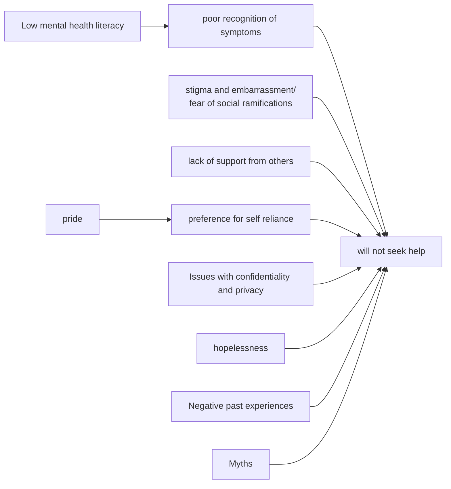

---
area:
  - "[[Diploma of Counselling]]"
section: "[[1 - Communication Skills and the Counselling Framework]]"
course: "[[1.1 - Establish and confirm the counselling relationship]]"
unit:
  - "[[1.1.2 - Establish the Nature of the Helping Relationship]]"
lecture:
  - "[[1.1.2.3 – Identify client anxieties about the counselling process and explore with clients]]"
tags:
  - concept
status:
---

## Myths about the Counselling Process
- It is only for people with [[Mental Illness]]
- It is for the weak
- It is a quick solution
- Counsellor dominates the conversation
- Counsellor changes your beliefs and values
- It is painful, unpleasant and scary
- Information shared is discussed with staff

Related: [[How to Cope With Resistance to Counselling]]